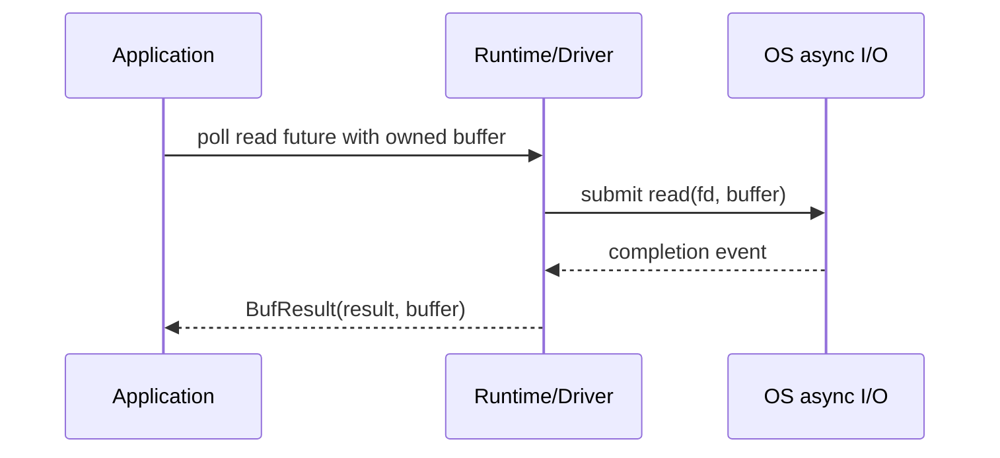
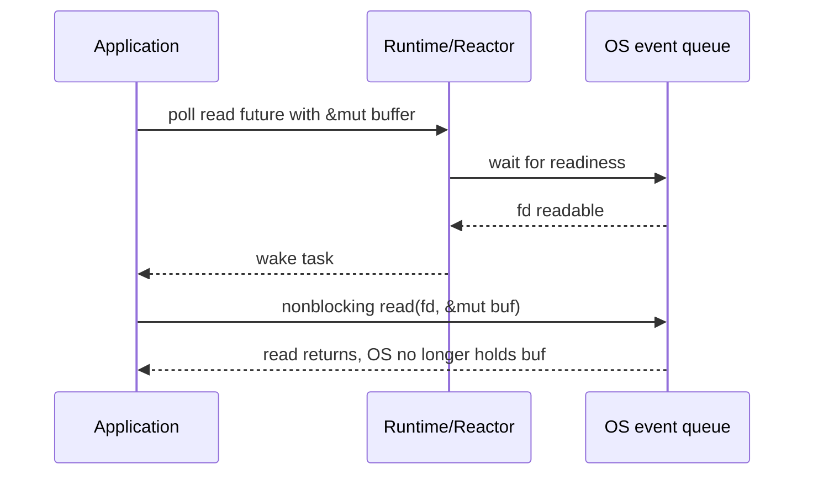

---
# 文章标题（展示在列表与文章页）
title: 从 SOCKS5 看异步运行时如何塑造上层库接口
# 标签（用于标签页与检索）
# 常见标签：Rust / Vue / Linux / 错误解决 等
tags:
  - 计算机
  - Rust
  - Tokio
  - 异步
# 短链接 ID（用于历史风格 permalink）
abbrlink: 6c2e5cd3
# 创建时间（格式：YYYY/MM/DD HH:mm:ss）
createTime: 2026/04/26 00:58:55
# 永久链接（默认：/YYYY/MM/abbrlink/，末尾保留 /）
permalink: /2026/05/6c2e5cd3/
# 封面图（可选）
# cover: /2026/05/6c2e5cd3/cover.webp
# 摘要（可选，不填可用 <!-- more --> 截断正文）
excerpt: 很多直觉上类似的机制，最后却并不能被优雅地抽象到同一个接口下。`epoll`​ 到 `io_uring` 、Reactor到Proactor不只是换个后端就能解决的，抽象总是会泄露，向上改变 runtime、库，甚至用户代码。
# 草稿（可选，true 时不会出现在列表中）
# draft: true
---

当我最开始接触Rust的时候，我以为基于 Future 的抽象可以抹平各个异步运行时的区别从而使用同一套接口，然而当我稍微深入了解一些后，我发现常用IO类型和扩展都是由运行时库提供的，再进一步，甚至在读写的基本接口形状上，它们的所有权转移情况也非常不一致。

于是就有了这一篇文章，我想要借助编写一个Socks5服务器这样一个简单的用例，来与大家探讨这个问题，让我们看看这些异步运行时（分别是[Tokio](https://tokio.rs)和[Compio](https://github.com/compio-rs/compio)）会在我们的代码形状和性能上留下什么样的痕迹。本文中我编写的部分代码可以在文末GitHub链接中获取，以MIT许可证开源。

## 协议层的边界

### 没有统一的 I/O 世界

最开始我想要复用 [socks5-impl](https://crates.io/crates/socks5-impl) 这个库，结合两个不同的异步运行时来完成一个简单的性能对比，但是我发现它提供的接口是这样的：

```rust
fn retrieve_from_stream<R>(stream: &mut R) -> Result<Self>
where
    R: std::io::Read,
    Self: Sized,
```

这个`R`​既不是`tokio::io::AsyncRead`​也不是`compio::io::AsyncRead`​，我们无法直接使用该接口。这个库提供了一个feature `tokio`，开启后我们就能使用tokio了：

```rust
async fn retrieve_from_async_stream<R>(r: &mut R) -> std::io::Result<Self>
where
    R: AsyncRead + Unpin + Send + ?Sized,
```

考虑到我并不想给这个库扩展新的运行时支持，我也无意为本文中涉及的代码引入各项工程化所必须的检查代码、规范做法，因此我决定自己实现。

### 协议层或许应该只处理 bytes

对IO的抽象方式不同引起了上述问题。说实话，依赖于`futures`​或`tokio`​的抽象确实很方便，我一看到`AsyncRead`​和`AsyncWrite`​就知道怎么用，我也会期待各种库，如`Quinn`​给我返回这些我熟悉的接口，虽说对我来说实现这些接口并不算方便，但是使用体验是没什么问题的——至少在我用`tokio`时没有遇到太多问题。

在这次尝试脱离`tokio`​的时候终究还是遇到了问题，我在思考我有没有办法设计一种接口，能够方便地让各种运行时使用呢？仔细想了想其实也不太好，我们可以将目光投向aws的[s2n-quic](https://github.com/aws/s2n-quic)库，我的同事很欣赏这个仓库的代码，我们也来看看它是怎么实现的。

阅读后我们会发现，这个库的核心层`quic/s2n-quic-core`​尽量保持了独立，而外层的`s2n-quic`​面向希望能直接上手的使用者，提供基于异步运行时的io抽象，这么看就明了了，我们这里需要的是一个`socks5-core`，如果只是借助这种想法来写一个demo函数的话，我觉得会是这样：

```rust
pub fn parse_connect_request(buf: &[u8]) -> Result<ConnectRequest, SocksError> {
    require_min_len(buf, 4)?;

    if buf[0] != VERSION {
        return Err(SocksError::InvalidVersion(buf[0]));
    }

    if buf[1] != CMD_CONNECT {
        return Err(SocksError::UnsupportedCommand(buf[1]));
    }

    if buf[2] != 0x00 {
        return Err(SocksError::InvalidReserved(buf[2]));
    }

    match buf[3] {
        ATYP_IPV4 => parse_ipv4_connect_request(buf),
        ATYP_DOMAIN => parse_domain_connect_request(buf),
        ATYP_IPV6 => parse_ipv6_connect_request(buf),
        atyp => Err(SocksError::UnsupportedAddressType(atyp)),
    }
}
```

总之，让`runtime adapter`​负责读写，而`protocol core`负责解析吧！

## Tokio实现

> 在开始写这部分的时候，我有点后悔了，因为我现在实在没有精力仔细设计一套合理的接口，因此后文只是借助“协议层或许应该只处理 bytes”的朴素想法设计的函数，实际上出现了普遍的抽象泄露问题，好在应该不影响前文想法的表达，只是让这篇文章显得没有那么成熟，这对我来说是可以接受的。

程序的主函数基本上是一个很典型的`tokio`服务器起手式，下面代码尽量暴露I/O接口差异的部分，工程化、协议标准性不是本文重点：

```rust
#[tokio::main]
async fn main() -> anyhow::Result<()> {
    let listener = TcpListener::bind(LISTEN_ADDR).await?;
    println!("Listening on {LISTEN_ADDR}");

    loop {
        match listener.accept().await {
            Err(e) => println!("Error: {e:#?}"),
            Ok((stream, src)) => {
                println!("Receive tcp stream from {src}");
                tokio::spawn(async move {
                    if let Err(e) = handle_socks5(stream, src).await {
                        println!("Handle {src} failed: {e:#}");
                    }
                });
            }
        }
    }
}
```

接下来只需要对着[SOCKS协议的RFC](https://datatracker.ietf.org/doc/html/rfc1928)写就是了，首先处理客户端请求，第一个来回交换认证信息，下面的代码块基本上遵循第一个是解析请求，第二个是构造回复的模式：

```rust
// +----+----------+----------+
// |VER | NMETHODS | METHODS  |
// +----+----------+----------+
// | 1  |    1     | 1 to 255 |
// +----+----------+----------+
async fn read_greeting(stream: &mut TcpStream) -> anyhow::Result<Vec<u8>> {
    let mut greeting = vec![0u8; 2];
    stream.read_exact(&mut greeting).await?;
    if greeting[0] != 0x05 {
        bail!("Not socks5!")
    }

    let method_count = greeting[1] as usize;
    greeting.resize(2 + method_count, 0);

    stream.read_exact(&mut greeting[2..]).await?;

    Ok(greeting)
}

// +----+--------+
// |VER | METHOD |
// +----+--------+
// | 1  |   1    |
// +----+--------+
pub fn encode_method_selection_no_auth() -> [u8; 2] {
    [VERSION, METHOD_NO_AUTH]
}
```

我们的实现为了简单起见，只实现无需认证的模式，在完成这一轮后，我们就需要响应客户端的代理请求了：

```rust
// 为了实现简单，此处假设所有请求的 CMD=0x01,即CONNECT请求
// +----+-----+-------+------+----------+----------+
// |VER | CMD |  RSV  | ATYP | DST.ADDR | DST.PORT |
// +----+-----+-------+------+----------+----------+
// | 1  |  1  | X'00' |  1   | Variable |    2     |
// +----+-----+-------+------+----------+----------+
async fn read_connect_request(stream: &mut TcpStream) -> anyhow::Result<Vec<u8>> {
    let mut req = vec![0u8; 4];
    stream.read_exact(&mut req).await?;

    match req[3] {
        ATYP_IPV4 => {
            req.resize(4 + 4 + 2, 0); // head(4) ipv4(4) port(2)
            stream.read_exact(&mut req[4..]).await?;
        }
        ATYP_IPV6 => {
            req.resize(4 + 16 + 2, 0); // head(4) ipv6(16) port(2)
            stream.read_exact(&mut req[4..]).await?;
        }
        ATYP_DOMAIN => {
            let domain_len = stream.read_u8().await?;
            let new_len = 4 + 1 + domain_len as usize + 2; // head(4) len(1) domain(?) port(2)
            req.resize(new_len, 0);
            req[4] = domain_len;
            stream.read_exact(&mut req[5..]).await?;
        }
        _ => {
            bail!("Unknown ATYP")
        }
    }

    Ok(req)
}

// 和上面基本一样，就是CMD变成了REP，另外为简单考虑，非重要地址均只返回全0
// +----+-----+-------+------+----------+----------+
// |VER | REP |  RSV  | ATYP | BND.ADDR | BND.PORT |
// +----+-----+-------+------+----------+----------+
// | 1  |  1  | X'00' |  1   | Variable |    2     |
// +----+-----+-------+------+----------+----------+
fn encode_reply(rep: u8) -> [u8; 10] {
    [VERSION, rep, 0x00, ATYP_IPV4, 0, 0, 0, 0, 0, 0]
}
pub fn encode_success_reply() -> [u8; 10] {
    encode_reply(0x00)
}
```

基本流程就是这样了，我们再把函数简单拼装一下就结束了：

```rust
async fn handle_socks5(mut stream: TcpStream, src: SocketAddr) -> anyhow::Result<()> {
    let greeting = read_greeting(&mut stream).await?;
    // 类似下面这行的调用只是封装了下校验逻辑，没必要看，另外考虑实现便捷，我们没有对错误情况进行回复，这是不符合标准的
    select_no_auth(&greeting)?;
    stream.write_all(&encode_method_selection_no_auth()).await?;
    println!("Received client hello: {greeting:?}");

    let request_buf = read_connect_request(&mut stream).await?;
    let req = parse_connect_request(&request_buf)?;
    println!("Socks5 CONNECT command from {src}: {req:?}");

    let mut to_target = TcpStream::connect(req.target_string()).await?;
    stream.write_all(&encode_success_reply()).await?;

    let (client_to_target, target_to_client) =
        tokio::io::copy_bidirectional(&mut stream, &mut to_target).await?;
    println!(
        "Done: client -> target: {client_to_target} bytes, target -> client: {target_to_client} bytes"
    );

    Ok(())
}
```

假如你尝试解析过任何协议，相信对上面的代码是十分熟悉的，我也是这样，但是当我把这些代码复制到Compio实现下时，就开始看到大量的所有权错误。

## Compio改写：owned buffer 如何改变代码形状

我们熟悉的`tokio`的接口长这样，我随便挑了一个出来：

```rust
// tokio::io::util::async_read_ext::AsyncReadExt
pub trait AsyncReadExt
pub fn read_exact<'a>(&'a mut self, buf: &'a mut [u8]) -> ReadExact<'a, Self>
where
    Self: Unpin,
    Self: AsyncRead,

pub trait AsyncRead {
    fn poll_read(
        self: Pin<&mut Self>,
        cx: &mut Context<'_>,
        buf: &mut ReadBuf<'_>,
    ) -> Poll<io::Result<()>>;
}
```

我可以把一个`Vec<u8>`​的可变切片交给这个函数，让它帮我把东西读进去，很好，但是`compio`不这么认为，它的接口是这样的：

```rust
// compio_io::read::ext::AsyncReadExt
pub trait AsyncReadExt
pub async fn read_exact<T>(&mut self, mut buf: T) -> BufResult<(), T>
where
    T: IoBufMut,
    Self: AsyncRead,

pub struct BufResult<T, B>(pub io::Result<T>, pub B);

pub trait AsyncRead {
    async fn read<B: IoBufMut>(&mut self, buf: B) -> BufResult<usize, B>;
    async fn read_vectored<V: IoVectoredBufMut>(&mut self, buf: V) -> BufResult<usize, V> {
        loop_read_vectored!(buf, iter, self.read(iter))
    }
}
```

我们观察可以发现这些事：

- ​`compio`​的接口不是`dyn compatible`​，根据[官方文档](https://doc.rust-lang.org/nightly/reference/items/traits.html#dyn-compatibility)说法，这是因为1.该函数是`async`的，会隐式返回Future 2.方法有类型参数。
- 说实话我觉得`tokio`​的`AsyncRead`​接口实现起来需要了解很多前置知识，我在新手时期看到这些`Pin`​和`Poll`​完全是一头雾水，而`compio`这套看起来更简单一些
- ​`compio`​需要拿走缓冲区`buf`的所有权
- ​`compio`​的返回值是一个`BufResult<T, B>`​而不是正常的`Result<T,E>`

那我们写写看有什么区别（作为对比，我把tokio对应代码写到注释里了）

```rust
async fn read_greeting(stream: &mut TcpStream) -> anyhow::Result<Vec<u8>> {
    // let mut greeting = vec![0u8; 2];
    // stream.read_exact(&mut greeting).await?;
    // 另外，Compio 的 IoBufMut 会把 buffer 的未初始化空间也纳入考虑
    let BufResult(res, mut greeting) = stream.read_exact(Vec::with_capacity(2)).await;
    res?;

    if greeting[0] != 0x05 {
        bail!("Not socks5!");
    }

    let method_count = greeting[1] as usize;
    let total = 2 + method_count;
    greeting.resize(total, 0);

    // stream.read_exact(&mut greeting[2..]).await?;
    let BufResult(res, greeting_tail) = stream.read_exact(greeting.slice(2..total)).await;
    res?;

    Ok(greeting_tail.into_inner())
}
```

一方面，我们要把我们的缓冲区所有权交出去，等待函数完成后拿回来，返回值的形状是`BufResult<操作结果, 被归还的 buffer>`​；另一方面，我们需要使用`buf.slice(a..b)`​的形式让读取函数只操作这段视图的数据，注意，这个方法会获取`buf`​的所有权，且返回值仍然是`Slice<Vec<u8>>`​，因此我们需要在返回前执行`buf.into_inner()`以取回我们的缓冲区。

其他函数也都大同小异，就不过多展示了，可以看一下主函数吧，因为这里我手动将线程数调整为了核心数，否则`#[compio::main]`默认的1会导致一些测试性能处于弱势。

```rust
#[compio::main]
async fn main() -> anyhow::Result<()> {
    let listener = TcpListener::bind(LISTEN_ADDR).await?;
    let worker_threads =
        std::thread::available_parallelism().unwrap_or_else(|_| NonZeroUsize::new(1).unwrap());
    let dispatcher = Dispatcher::builder()
        .worker_threads(worker_threads)
        .build()?;

    println!("Listening on {LISTEN_ADDR} with {worker_threads} compio worker threads");

    loop {
        match listener.accept().await {
            Err(e) => println!("Error: {e:#?}"),
            Ok((stream, src)) => {
                println!("Receive tcp stream from {src}");
                if dispatcher
                    .dispatch(move || async move {
                        if let Err(e) = handle_socks5(stream, src).await {
                            println!("Handle {src} failed: {e:#}");
                        }
                    })
                    .is_err()
                {
                    println!("Dispatch {src} failed");
                }
            }
        }
    }
}
```

## Reactor和Proactor

是什么导致了这种API设计差异呢？我认为并非单纯是库开发者的爱好，实际上[monoio](https://github.com/bytedance/monoio)的接口和compio基本一样：

```rust
let mut buf: Vec<u8> = Vec::with_capacity(8 * 1024);
(res, buf) = stream.read(buf).await;
if res? == 0 {
    return Ok(());
}
```

它们之间的近似性是由于它们的公开接口均主要参考Proactor的异步风格设计（类似IOCP、io_uring），而tokio基于Reactor的风格设计（类似epoll、kqueue）。下面两张图先后展示了Proactor风格和Reactor风格：





假设我们使用Proactor风格的接口，系统返回结果时，读取已经完成，而Reactor返回的是一个可读信号。设想一下，假如我们将Proactor的接口设计为传入可变引用，会是什么样的后果呢：

```rust
let fut = proactor_read(&mut buf);

// 假设这个 future 已经被 poll 过，
// 并且 read 操作已经提交给内核/运行时。
// 此后即使 drop(fut)，也不一定意味着外部 I/O 操作已经停止。
drop(fut);
```

而Reactor风格的接口通常没有这个问题，它等待的是“fd 变得可读”这个事件，任务被唤醒后，应用再调用一次read，将数据拷贝进`&mut [u8]`，或许正是这种差异导致了两种不同的接口偏好。

## 取消一个任务

在调用`tokio`​提供的函数时，我们会看到一个概念`Cancellation safety`​，例如`tokio::io::AsyncReadExt::read`​是可安全取消的，而`tokio::io::AsyncReadExt::read_exact`​不是，根据[官方文档](https://docs.rs/tokio/latest/tokio/macro.select.html)的说法，可安全取消被定义为“对于尚未完成的Future，删除并重新创建它是一个空操作”。

上述说法听起来有点拗口，其含义主要就是在`loop{ tokio::select!{ ... } }`​中，当另外一个分支执行，并通过循环重新执行select时，不应丢失之前的进度，像是对于`read_exact`，在其他分支完成时，它可能已经把一些数据读入缓冲区了，重建会丢失进度。

这么看，其实`tokio`中正常的异步任务可以通过Drop停止继续推进，但是对于Compio又如何呢？

从源码看，`runtime::submit`​ 返回的 future 在被drop时确实会尝试取消已提交的操作，关键在于，这些取消都是尽力为之却不一定可靠（[官方文档](https://docs.rs/compio-driver/latest/compio_driver/struct.Proactor.html#method.cancel)指出`The cancellation is not reliable. The underlying operation may continue, but just don’t return from Proactor::poll.`），因为底层IO可能已经被操作，取消了future并不意味着外部世界没有发生改变。

## 一个简单的性能观察

测试做的比较简单，仓库里也能看代码，不是严肃的benchmark，图一乐看看吧

```rust
# Windows 11; 32GB RAM; Intel Ultra7 270K Plus
Target HTTP server: http://127.0.0.1:18081/
SOCKS5 proxy address: 127.0.0.1:10800
Requests: 2000, warmup: 200, body: 16384 bytes, rounds: 1, concurrency: [1, 16, 64]

impl     round  conc       ok      err      req/s      MiB/s    avg ms    p95 ms    p99 ms    max ms
tokio        1     1     2000        0      766.2       12.0     1.302     0.954    20.589    39.183
tokio        1    16     2000        0    10958.5      171.9     1.453     1.773     5.684    10.179
tokio        1    64     2000        0     9918.8      155.6     5.918     6.695     7.991    26.040
compio       1     1     2000        0      917.8       14.4     1.087     0.712    19.471    26.439
compio       1    16     2000        0     9948.0      156.0     1.484     2.042     3.137    17.229
compio       1    64     2000        0    11005.2      172.6     5.736     6.706     7.290    12.259
```

## 总结

上文主要讨论了我从学习异步Rust、接触Tokio到接触其它运行时过程中发现的问题，我发现Rust生态中的不同运行时生态似乎有些碎片化，某些库能够提供一定程度的共同抽象，而更多是强依赖Tokio。不同运行时的差异比我想象中要大，很难无缝切换，上文还只讨论了基础部分，如果再考虑到各种同名接口的不同行为、调度模型会更加不一致（如双向拷贝遇到单侧EOF的行为）。

从上文构造的Socks5服务器来看：Reactor（或者说Readiness）风格的接口在Rust生态中常常操作可变引用；而Proactor（或者说Completion）风格的接口常常取走所有权。

类似问题并不只出现在 Rust。Go 曾经有过“是否能透明支持io\_uring”的issue，Erlang社区也讨论过io\_uring支持，这些讨论最后都没有变成一个轻松透明切换后端的故事。经过了上述的探索和尝试，我想不甚严谨地做出这样一个总结：

很多直觉上类似的机制，最后却并不能被优雅地抽象到同一个接口下。`epoll`​ 到 `io_uring` 、Reactor到Proactor不只是换个后端就能解决的，抽象总是会泄露，向上改变 runtime、库，甚至用户代码。

## 推荐阅读

- [文中涉及的代码示例](https://github.com/mcthesw/async-runtime-compare)
- [金枪鱼之夜：基于完成的 Rust 异步：compio 项目及其经验](https://tuna.moe/event/2024/compio/)
- [Async Rust is not safe with io_uring](https://news.ycombinator.com/item?id=41992975)
- [Async Rust can be a pleasure to work with](https://emschwartz.me/async-rust-can-be-a-pleasure-to-work-with-without-send-sync-static/)
