---
# 文章标题（展示在卡片与文章页）
title: 薛定谔的电话
# 标签：用于标签页与卡片信息
# 游玩记录状态：通关！/游玩中/搁置/想玩/放弃
tags:
  - 游戏
  - 游玩记录
  - 状态:通关！
# 短链接 ID（用于历史风格 permalink）
abbrlink: 7ecdcee7
# 创建时间（格式：YYYY/MM/DD HH:mm:ss）
createTime: 2026/07/24 22:40:20
# 永久链接（默认：/YYYY/MM/abbrlink/，末尾保留 /）
permalink: /2026/07/7ecdcee7/
# 封面图（可选）
# cover: /2026/07/7ecdcee7/cover.webp
# 摘要（可选，不填可使用 <!-- more --> 自动截断）
excerpt: 没有发挥在玩法和叙事结构上的潜力，但它最终还是凭借玛丽的故事和出色的演出击中了我
# 草稿（可选，true 时不会出现在列表中）
# draft: true
---

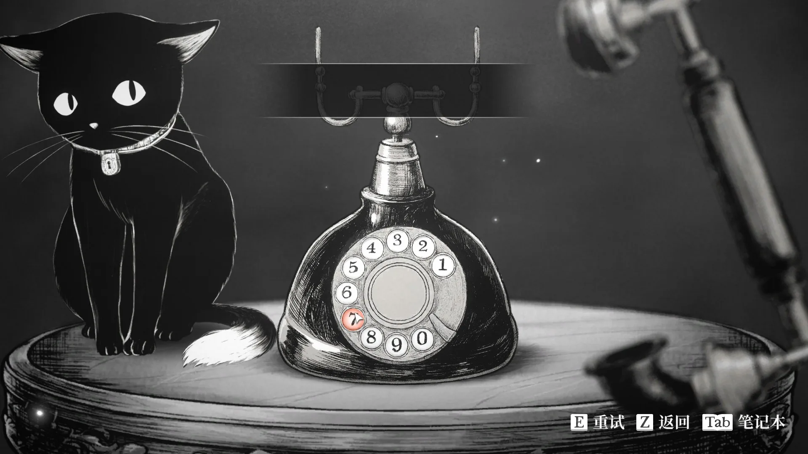

之前玩了 Demo 后感觉非常有趣，因此果断入手，然后就在前段时间通关了，然而在撰写这篇通关感受的时候，我却感觉有点不知道怎么写了，总体上来说，我是喜欢这个作品的，不过它的优点和缺点非常明显。

总体上来说，我认为本作的画面表现、配乐做的很不错，但是故事的结构和情节稍显逊色，另外可能考虑到成本缘故，1-3章能让我感到一些素材复用，另外输入电话的玩法这种设计谁能忍住不塞一点东西（提前拨打后面的电话？留一点小彩蛋？让我想到了「你和她和她的恋爱」）但是似乎并没有这样的设计，太可惜了！

## 故事本身

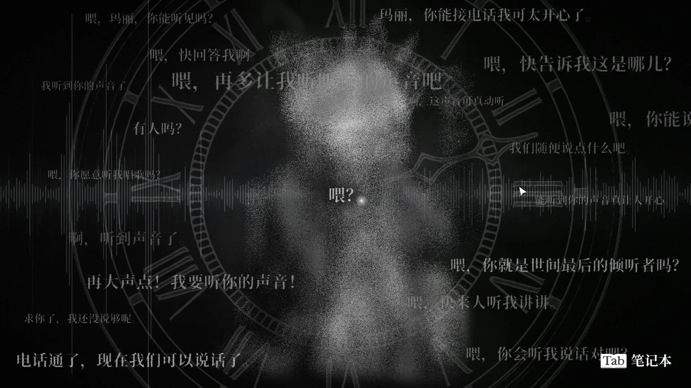

正如我在 demo 板块讲过的，前几章基本上都是类似的结构，即通过「电话」来解决别人的心结，随着一通电话的推进，我们可以在笔记本上记下需要的内容!!言弹？证物？！!!

主角的小涂鸦还是很有趣的，黑猫哈姆雷特也会在上面适当补充内容，不过考虑到笔记本的内容基本上和章节内容非常强相关，我在此还是不放出了，避免出现过于严重的剧透，总之我们会为章节底的「救赎」做好一切调查准备！

除了故事本身之外，让我感到可惜的还有一点是「选择的影响」，其实在玩了第一章的时候，我以为这个「薛定谔」加上这个对话的选择，会是「Slay the princess」那样丰富的选择分支，以致后续故事发展完全不同，可惜这个游戏的选项更像是单纯让玩家获取参与感的一种小技巧！

## 我的感受

::: warning
下方包含了对故事章节安排、故事情节的严重剧透，如果阅读会严重影响你的初见游戏体验，请确认自己确实想要继续阅读下去再往下翻！图片之后即为剧透！
:::

说实话，在刚玩完这个游戏的时候我是非常感动的，这么说是因为我在一定程度上可以和玛丽共情的，最后一章节的精彩程度也表现得超过前面章节，这点让我很是惊喜，我们居然有机会以玛丽的视角探索她曾住过的地方，了解她的故事。

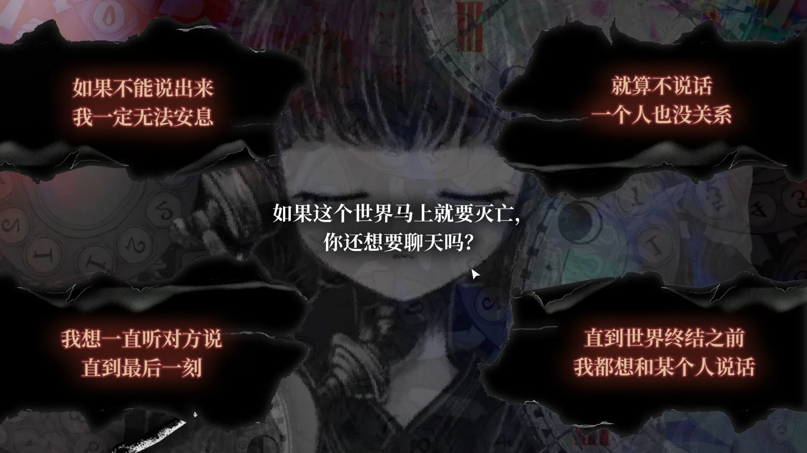

想要了解最后在讲什么，就必须先看看前面几个章节讲的是什么故事，它们毕竟不可能是被无缘无故安排进来的。

每个章节的最后，玛丽都会尝试扮演通话的对端，让「未完通话」（本章主要人物在世界毁灭时正在进行的通话）继续演绎下去，从而消除对方的心结，前几章在我我初次通关的时候感觉莫名其妙——这些东西真的存在吗？它们和小玛丽是什么关系？在现在我终于找到了一些关系，来说说我的想法：

在所有的这种故事中，玛丽都扮演了一个已经缺席的人，接起了不可能被接通的电话，我们可以认定这是一个谎言。

第一章节的故事中，Lucy出狱后只想尽快与自己的孩子通话，除去各种复杂的情感，实际上露西最想要的，是和孩子确认相互的爱，而这一切被世界毁灭打断，留下了一段未完通话，于是玛丽扮演威廉给了露西一个可以安息的回答，一个明显善意的谎言。

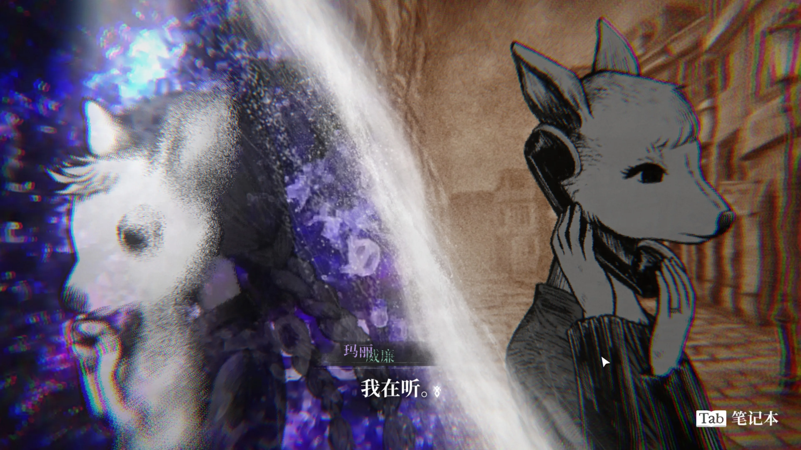

第二个故事中，托马斯的恋人失踪，被他归咎于自己的责任，他常打向这个再也无人接听的电话，玛丽再次扮演了缺席者，以善意的谎言救赎了一个厌恶自己的人。

第三个故事，玛丽与被恋人塞拉斯背叛（或许不能这么简单的描述，但是我不想把这个故事展开太多，因此请读者暂且接受我这样描述吧）的薇奥莱特通话，她发现真相无法救赎对方，于是尝试了编造了美好的谎言，但是也没有成功救赎薇奥莱特。

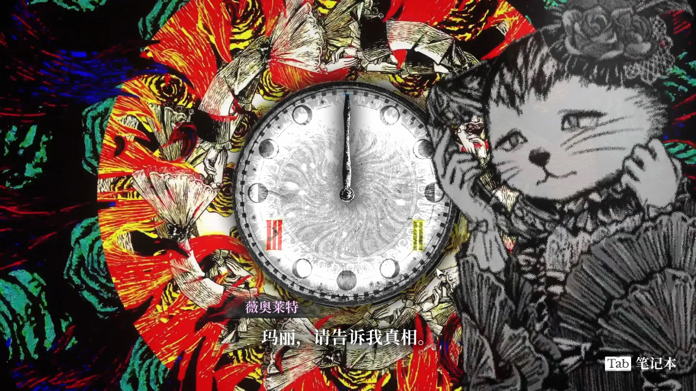

这个时候哈姆雷特指出，前两个故事中玛丽引导了命运之光，使之射向前方（按照合理的轨迹预演），而这次合理的轨迹怎么都是不能救赎维奥莱特的，因此需要「偏折」出一个不存在的未来，于是玛丽在承受一定代价后扮演塞拉斯，对薇奥莱特诉说了爱意，在对话进行到最后时，我们会发现薇奥莱特实际上已经认出了对方是玛丽，却没有因此否定这通电话，她接受的是玛丽的真心（电话那端的玛丽确实在意我）而非扮演（电话那端的塞拉斯爱我）。

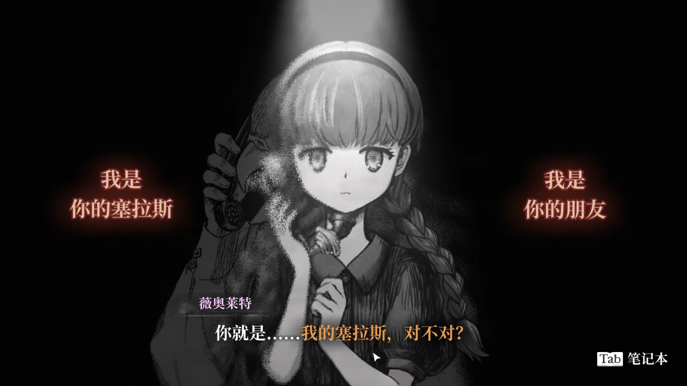

四章却改变了此前的方向，玛丽不再是替一个缺席的人接起电话，而成了那个拨出电话、等待对方回答的人。

直到这时我们才知道，玛丽之所以如此擅长扮演别人，是因为她在生前便已经扮演过艾莉。她欺骗自己这个谎言（扮演艾莉的鬼魂）是为了安慰失去女儿的菲利普，实际上，她更多是渴望得到菲利普给予艾莉的爱。

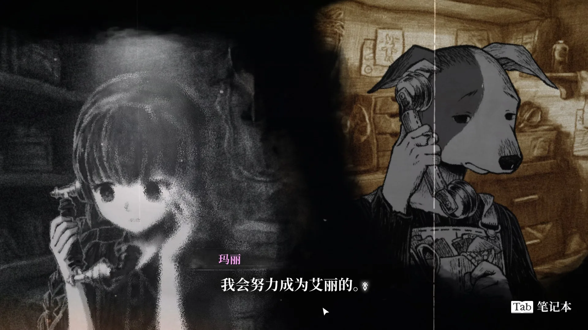

她似乎相信，自己只有成为别人需要的那个人，才有资格继续留在对方身边。她想成为艾莉，并不仅仅是因为她嫉妒艾莉，而是因为艾莉是一个被爸爸爱着的好孩子；如果玛丽也能成为艾莉，也能成为一个足以拯救所有人的好孩子，那么爸爸或许就不会再抛下她。

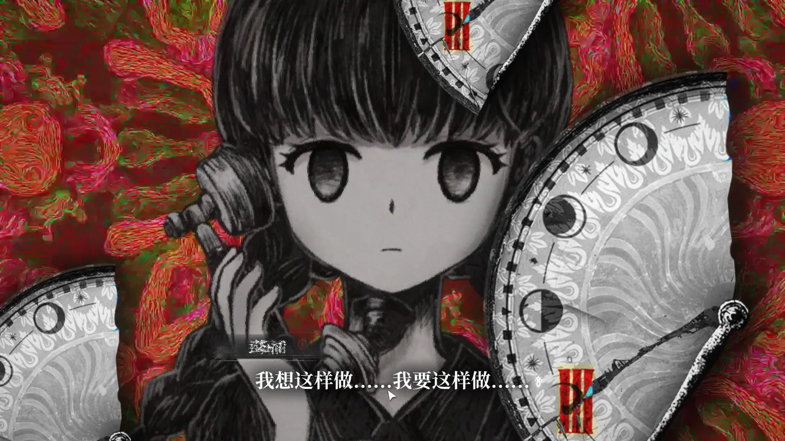

玛丽的愿望说到底似乎非常简单。她只是希望自己能够成为某个人重要的存在，希望有人愿意注意她、听她说话，希望与重要之人的通话永远不要结束。

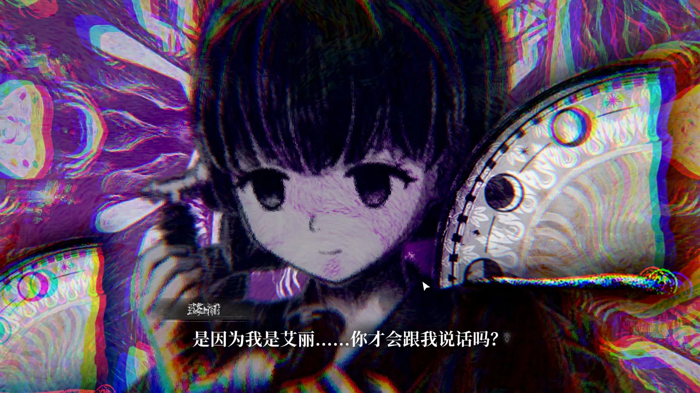

在此时，我似乎明白了作者想要让我们做什么：我们先从前面三个章节隐约感觉到一些暗示，然后在第四章节了解到玛丽的故事，最终模仿玛丽的形式，在世界毁灭前的21纳秒中，以她之前的形式救赎她，我们要做的不多，只需要倾听真实的玛丽就够了。

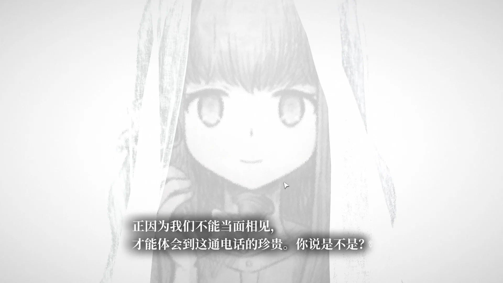

## 电波

不知是不是近年来精神状态的缘故，导致我特别喜欢电波作，而本作虽然没有那么电波，但是狂气元素还是在我这给了一点加分，就不细说了，电报需要的是感受（

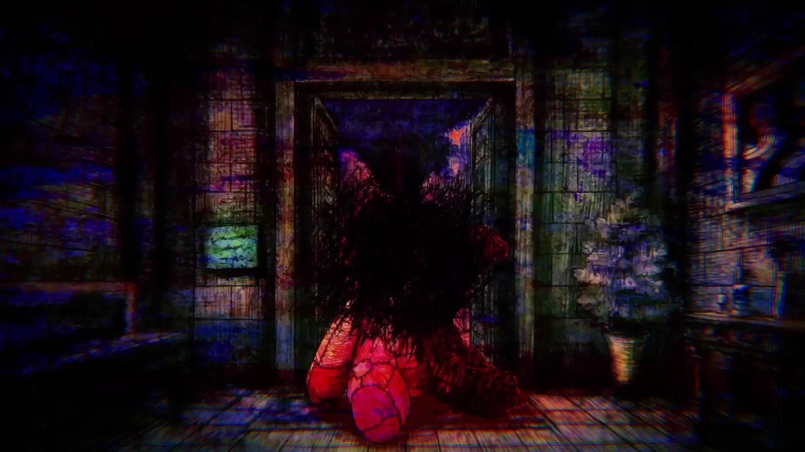
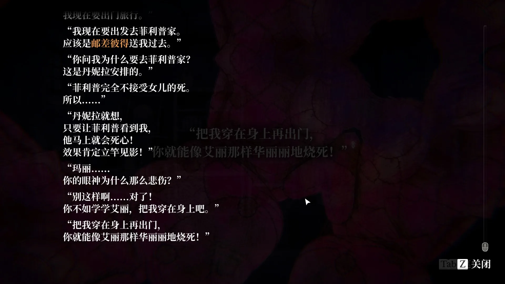
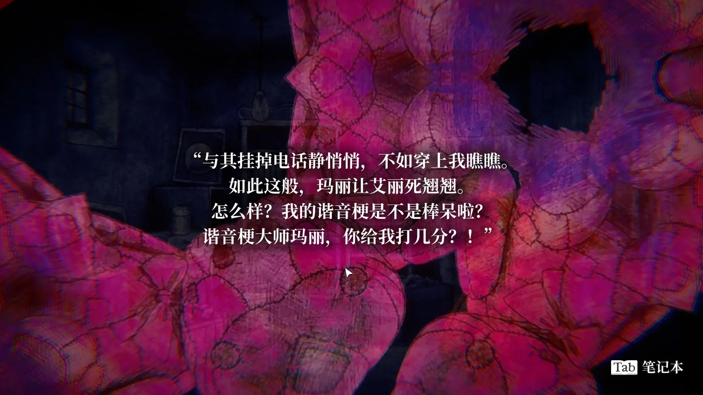

## 小总结

这是一个有瑕疵，但是我喜欢的游戏，买了不亏！但是我不会把它推荐给所有人。