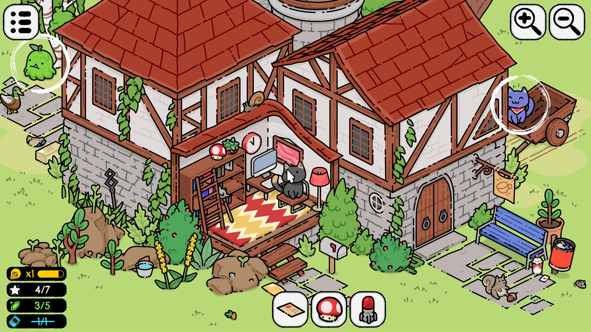
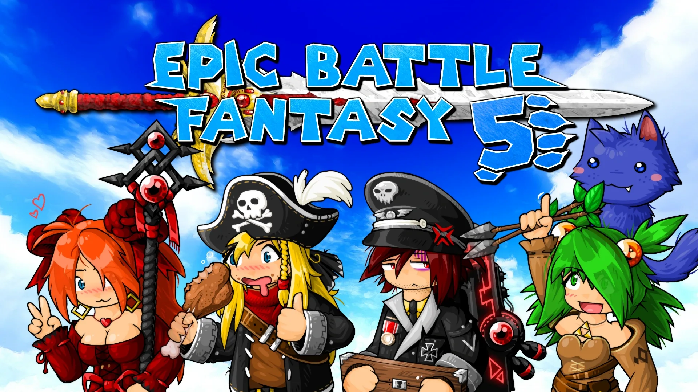
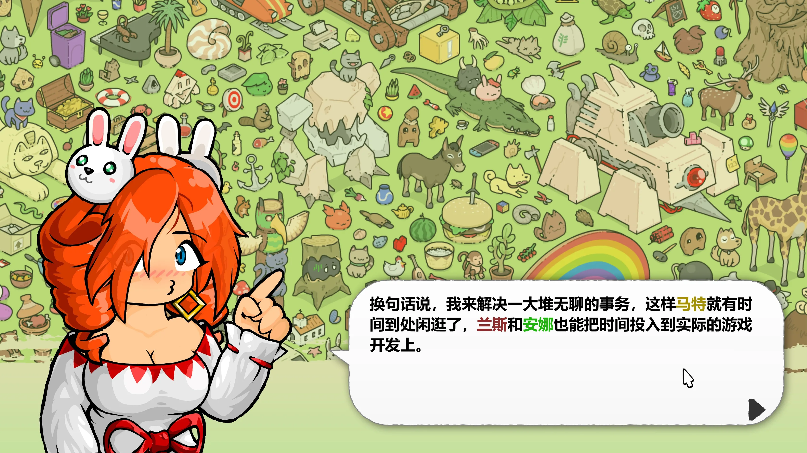
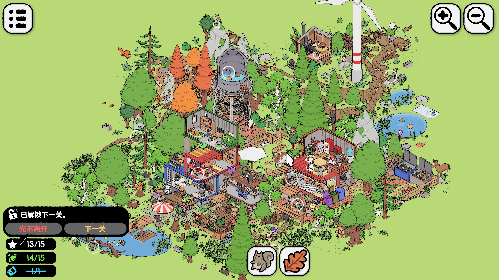
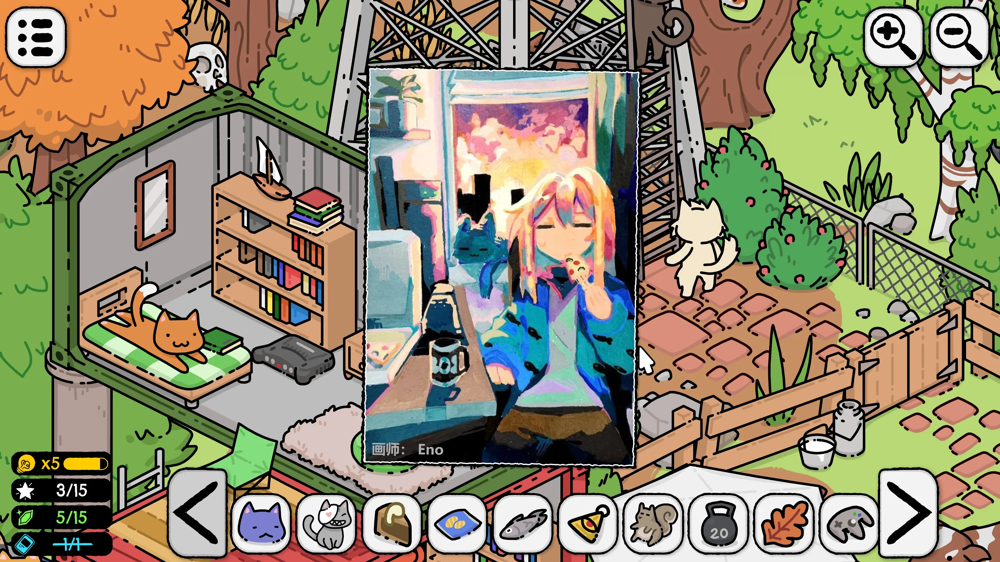
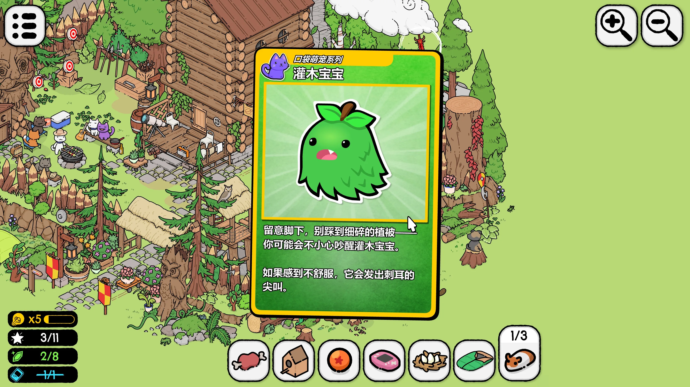

---
# 文章标题（展示在卡片与文章页）
title: Matt's Hidden Cats
# 标签：用于标签页与卡片信息
# Demo 标签建议：期待:8.5（或 期待值:8.5 / expect:8.5）
tags:
  - 游戏
  - Demo体验
  - 期待:7
# 短链接 ID（用于历史风格 permalink）
abbrlink: 5574b166
# 创建时间（格式：YYYY/MM/DD HH:mm:ss）
createTime: 2026/02/09 22:43:35
# 永久链接（默认：/YYYY/MM/abbrlink/，末尾保留 /）
permalink: /2026/02/5574b166/
# 封面图（可选）
cover: title-bar.webp
# 摘要（可选，不填可使用 <!-- more --> 自动截断）
excerpt: 制作精美的找猫猫！
# 草稿（可选，true 时不会出现在列表中）
# draft: true
---

听说做了 [Epic Battle Fantasy](https://store.steampowered.com/app/432350/Epic_Battle_Fantasy_5/) 的 Matt 有了新游戏，我立刻将它加入了愿望单，直到前一段时间，我从 Steam 收到了试玩版已经推出的通知邮件，果断下载！

## 我对 Matt 的印象

前作是一个 Flash 制作的小 JRPG，虽然有各种各样的缺点，但是总体上是一个非常有趣的游戏，我现在还记得这只蓝色的猫咪似乎叫没腿（Noleg），游戏的主角似乎也是主创团队，从零几年到现在居然能一直一起做游戏到现在，感觉还是有点羡慕的。

EBF5 很好玩的一点是可以捕捉各种怪物帮助你进行战斗，这些怪物也包含了很多 BOSS！

先不说 EBF 了，看看本作呢？娜塔莉负责了社区运营，兰斯是游戏的主程序，安娜负责了美术创作，而马特是「点子王」，这是做什么的？

## 画面和音乐

这样一个放松向、找东西的游戏，其最重要的自然是带给人舒缓的感受，从上面的图里你应该可以看到，本作的画面对比之前的游戏有了相当的进步，即使在高分辨率屏幕下也不会看到模糊。
除了可爱、精美的画面，游戏的音乐似乎是一些新的音乐加上之前 EBF 的 OST，总体来说也非常不错，游戏场景中的收音机在点击后也可以切换音乐。

## 游戏系统和玩法

本作居然是 Flash 制作的！

没错，它的清晰源于它是矢量图，这下搞懂了。另外，这个游戏可能还是我第一个接触过使用了 Rust 的游戏，因为他用的是 [Ruffle Flash 播放器](https://ruffle.rs)，创作工具也都有点年头了。

我最初几关一直是在中等难度下玩游戏的，这个难度下，主要有三种需要寻找的物件：

- 目标物品，找到后会在地图上圈出来，不必找完即可解锁下一关，如果找不到的话可以用充能条获得提示
- 宝石：找到宝石后会显示增加一些钱，不太清楚有什么用
- 特殊物件：不太清楚，似乎是一些美丽的插图或收集卡片（见下图）

本作的交互元素非常多，几乎所有东西点击后都会发出符合直觉、令人舒适的反馈音，某些猫猫还会发出奇怪的叫声，多次点击还有一些特殊效果（比如生气或爆炸），值得一提的是，正在和你对话的人物也是可以点击的。

另外，我注意到这个游戏还有一个好感度系统，暂时不清楚是做什么的，似乎是关卡间的对话产生的好感变动。

## 困难模式

浅浅尝试了一关困难模式，大多数物体的寻找难度只是稍微上升，但是出现了一些需要顺序寻找的物体，例如你需要先找到斧头才能砍伐一棵树木，通过互动而非单纯的寻找来收集物品，说实话难度确实上升了不少，如果你擅长找东西或小解密，不妨试试！

## 总结

总的来说，这类游戏只要玩法合适、音乐画面优秀，就足以让我有所期待，落后的 Flash 居然带来了格外清晰的画面，让我觉得非常舒适，我将给出7分期待值！
