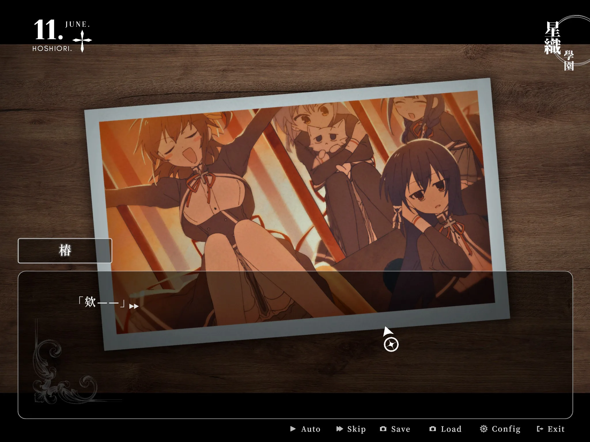
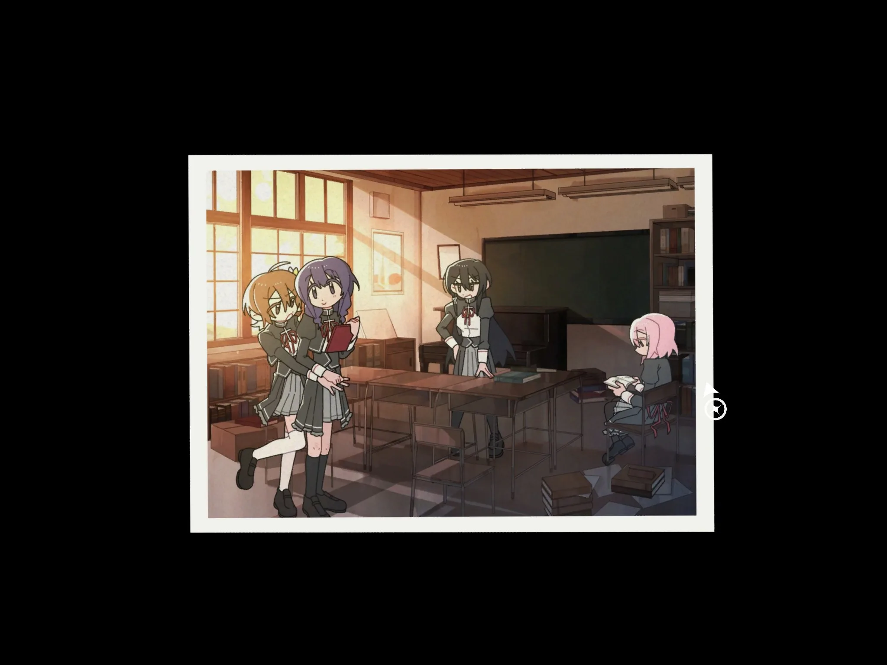
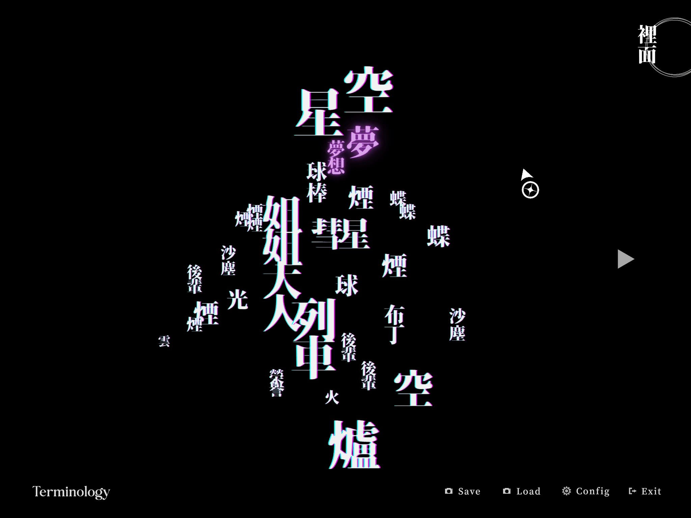
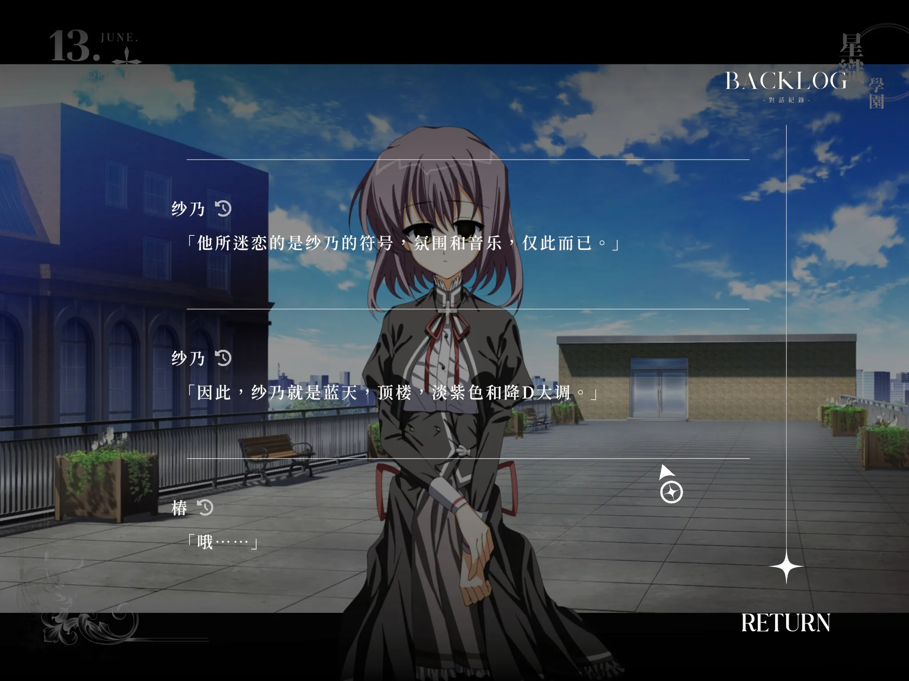
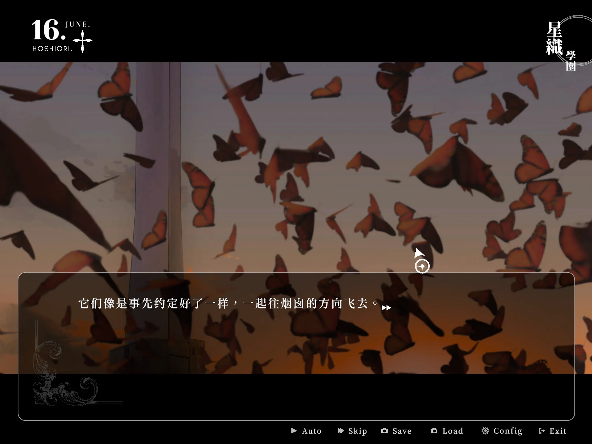

> 文学、古典乐与铁道

<!-- more -->

<!--
图片插入示例（推荐把图片放在当前目录，和 index.md 同级）：

如果图片在 public 目录：

-->

最初看到这个游戏是在发现了宣传视频：

@[bilibili](BV1oEPTemE4V)

在去年初玩过终之空之后，我就很想再找到类似氛围的游戏体验一下，在发现了这个游戏出了试玩后立刻就下载了。

## 故事

进入游戏后似乎是一位「车掌」在候车站引导玩家通过一张张车票以少女「椿」的视角看到回忆的片段，这些记忆片段发生的舞台主要有两个：①驶往绮罗星的列车上 ②星织学院中。下面一小段是在尽量不剧透的情况下讲讲Demo的故事。

在学院中主要是文学部中的轻松日常，出现的角色除了图片上文学部的几位以及学院中其他少女，Demo中着重讲述的似乎是棒球部部长「铃代」的故事，主角在她的帮助下，完成了一件「车掌」未能预料到的事情，从而能在少女「司」的指引下，了解到我们需要像这样将更多织星少女（像是铃代一样星织学院的学生）送上列车，这似乎是为了阻止「车掌」的阴谋，Demo版的故事到此就结束了。

## 氛围

我一直认为，对于一个电波作游戏来说，电波和氛围要比故事本身更重要，这个Demo较为出彩的地方我认为是其恰当的配乐，以及三选一剧情中与文学部少女独处的一段。我选择了纱乃，非常有音无彩名的感觉。

前面说的两个故事线也都笼罩着轻微不安的氛围。列车不论是本身、目的地、中间站都是谜团，不同的车厢有着完全不同的色调，在列车上发生的故事也不具备学院故事中较为欢快的氛围。
虽说如此，学院中关于蝴蝶、绮罗星、烟囱的传闻也一直从各个角色的对话中暗示着它的存在，相信正式版会逐渐向我们揭示这一切。

## 选关

如开头所说，是「车掌」一直在引导我们通过车票窥视「椿」的记忆，我最初以为是需要按照顺序来选择，或者只有有限的选择，但是发现大多数车票都是需要全部选择后才能推进剧情继续（不论是发生在车站还是车票本上），目前只有一处需要做出排他的选择，在后续剧情中或许会有一些作用。

## 总结

这个体验版在配乐上做的较为出色，氛围渲染还可以，故事目前还没有展开，看不出什么，总体体验中等偏上，考虑到电波系游戏的稀缺性，还是值得一试的，我会给出 6/10 的期待值。