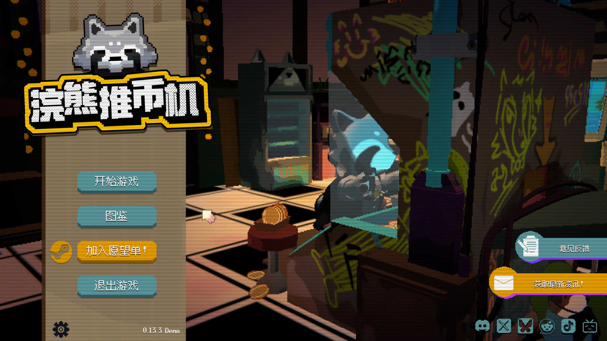
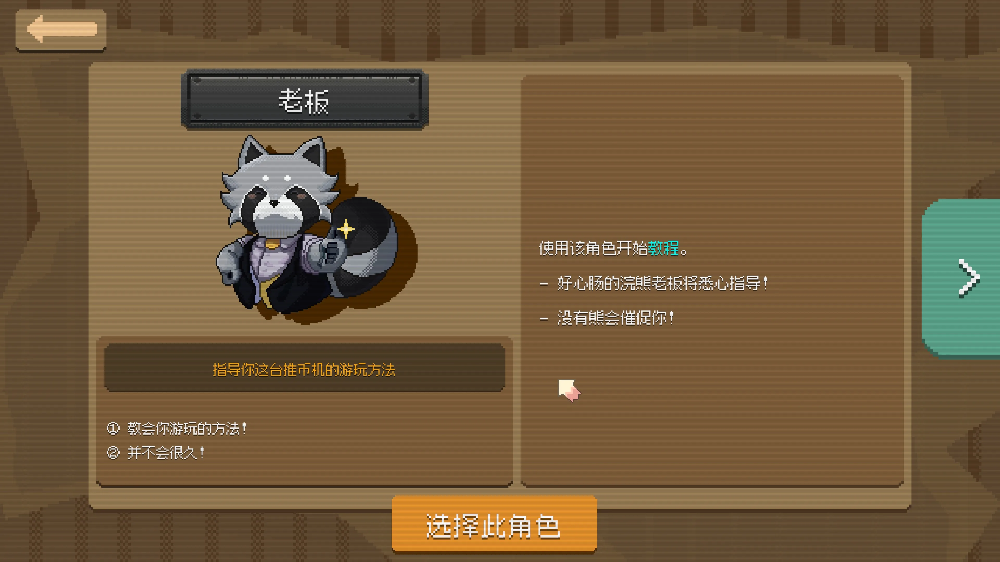
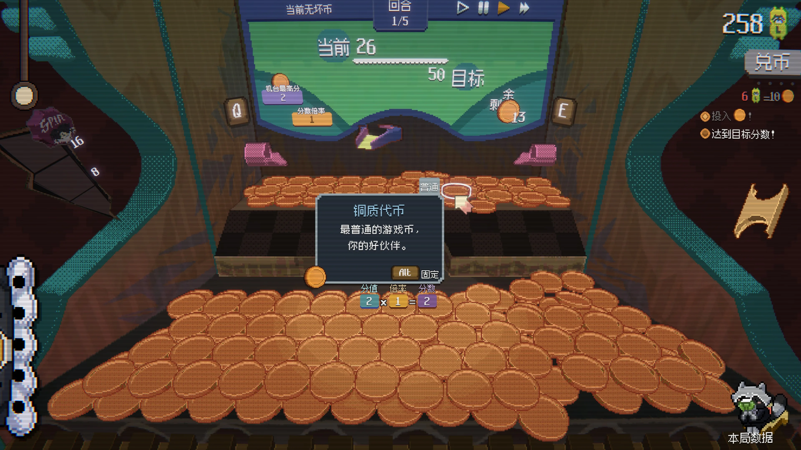
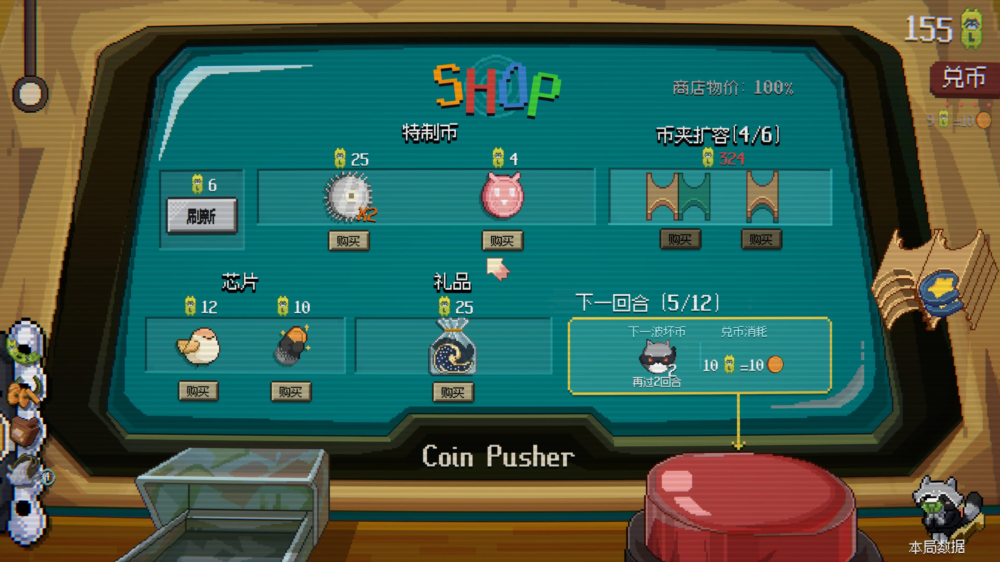
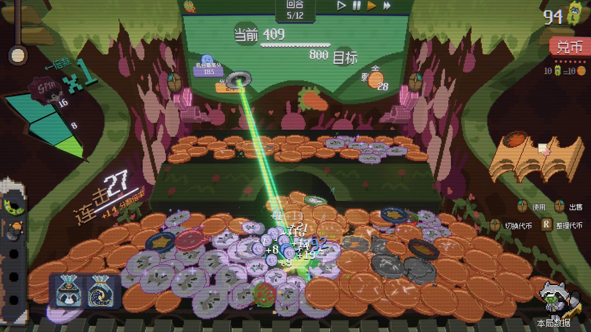
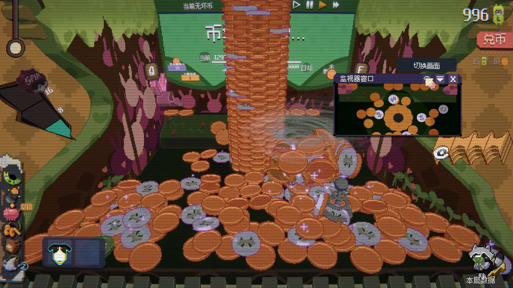
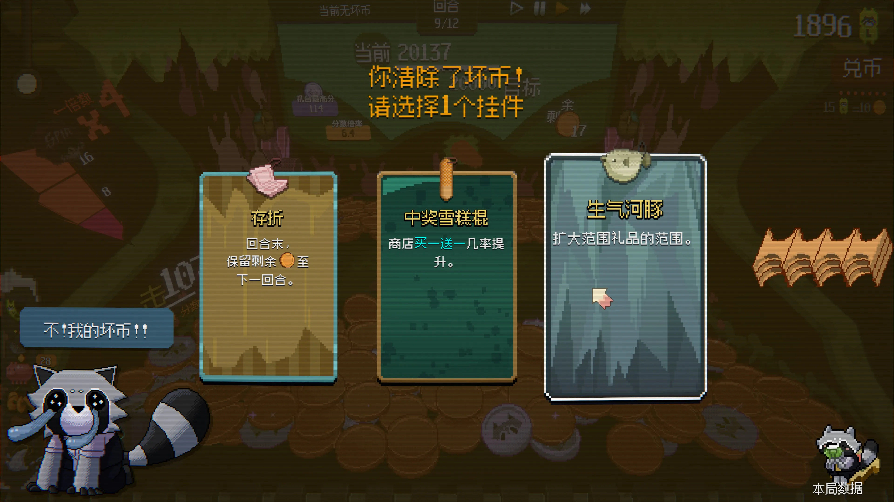
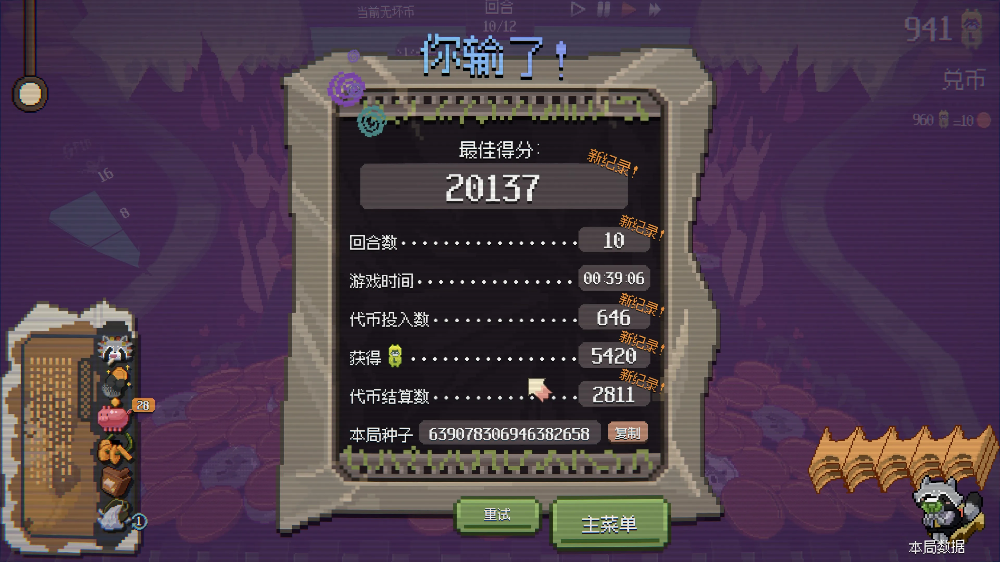
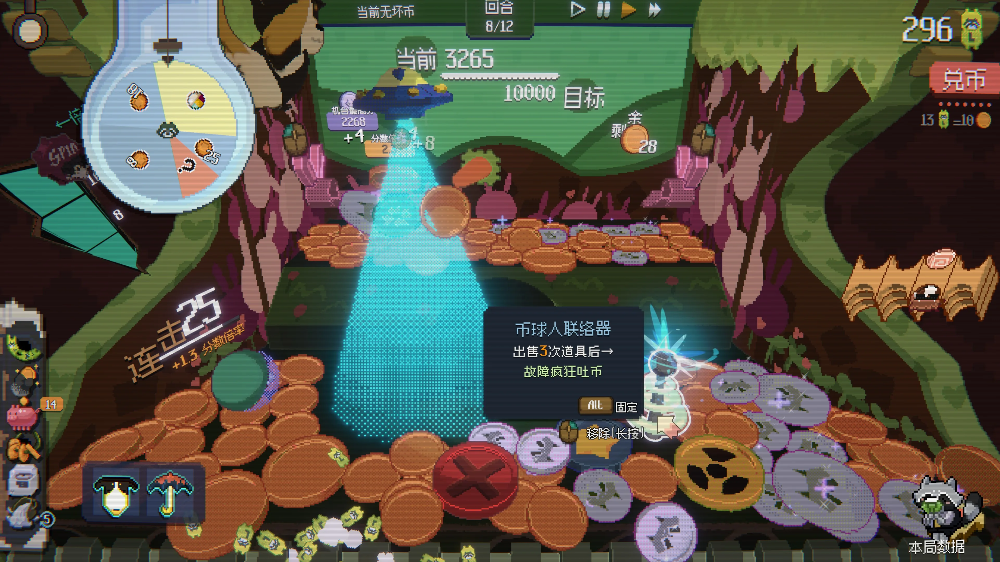

---
# 文章标题（展示在卡片与文章页）
title: 浣熊推币机 Demo
# 标签：用于标签页与卡片信息
# Demo 标签建议：期待:8.5（或 期待值:8.5 / expect:8.5）
tags:
  - 游戏
  - Demo体验
  - 期待:6
  - Steam新品节
# 短链接 ID（用于历史风格 permalink）
abbrlink: 8de0e4f6
# 创建时间（格式：YYYY/MM/DD HH:mm:ss）
createTime: 2026/02/28 00:35:15
# 永久链接（默认：/YYYY/MM/abbrlink/，末尾保留 /）
permalink: /2026/02/8de0e4f6/
# 封面图（可选）
cover: 2030AC~1.webp
# 摘要（可选，不填可使用 <!-- more --> 自动截断）
excerpt: 肉鸽推币机
# 草稿（可选，true 时不会出现在列表中）
# draft: true
---

## 初体验和介绍

刚打开游戏，很萌的浣熊出现了！

他是这里的老板，会教我们如何玩推币机，第一关刚开始感觉还很普通，感觉就是游戏厅里我从来不会碰的推币机。

鼠标左右键或键盘QE即可控制左或右侧吐出硬币。到了第一局结束进入商店，这个游戏才真的逐渐向我们展开玩法：

这张图向我们展示了几个特殊机制：

- 特质币是一种可以放到币夹，可以从中间摆动的币口中吐出的特殊硬币，它们或许可以给周围的硬币加分，或吸附周围的硬币，或消灭某些硬币，甚至能爆炸，想好本局使用哪些特质币（卡组？）
- 芯片是一种可出售的局内永久增益，类似杀戮尖塔的遗物，例如将本回合没用完的币带到下一回合，或是增加兑币次数
- 礼品往往是一些可消耗道具，提供一次性或N次使用的强力效果

在回合中搭配构筑这些道具，加上桌上的币，就是你要准备的所有东西！作为新手，偶然发现一些好玩的还是非常惊喜的，老板每隔几回合还会往场上丢一些坏硬币，不推下去或者消灭就会产生debuff。

在达成连击后还会触发抽奖，可能抽到硬币雨、玩具或奇怪的东西，这些机制也很有爽感。

清除坏硬币会得到一些效果奖励：

游戏机制似乎主要就是上面这些，初次游玩的体验还是很不错的，游戏也提供了变速功能，可以适当调整到自己喜欢的速度。

## 简评
玩了两局都输了，很可惜，我感觉这个游戏是存在很多爽点的，比如硬币哗哗落下、抽中大奖、设计的连锁反应触发等，这些都是不错的设计，现在传统娱乐+肉鸽的玩法确实被证明有开发潜力（参见小丑牌）。

不过本游戏也让我感觉到了几个缺点：

- 如果已经玩烂了，距离死亡前就会有一段较长的垃圾时间
- 本游戏可能存在某些泄露问题？因为我越玩越卡
- 游戏寿命会有多长呢？目前感觉深度还是差点意思
- 虽然可以控制速度，但是玩家整体节奏还是被推币的循环掌控的，而不能自己掌握节奏

总体来说，我觉得作为demo体验还是不错的，我给出7的期待值。