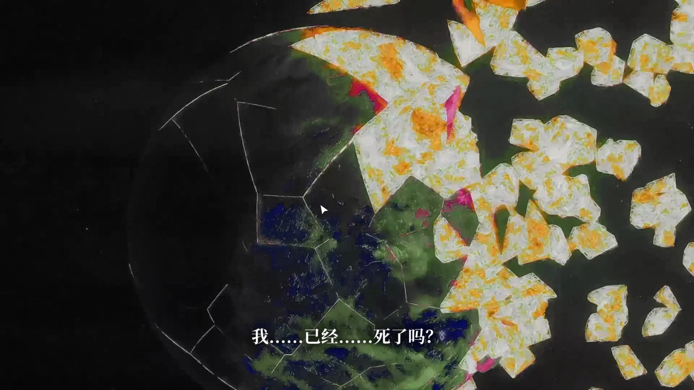
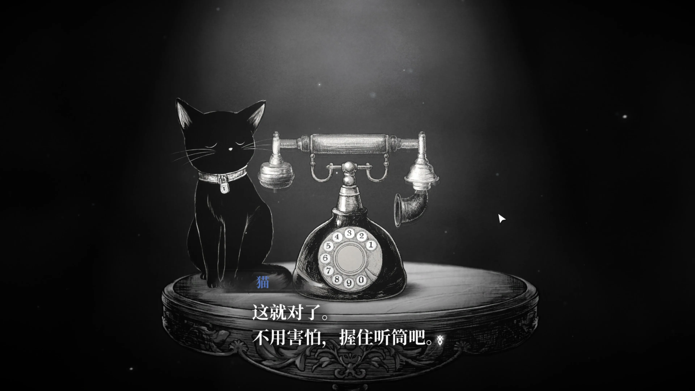
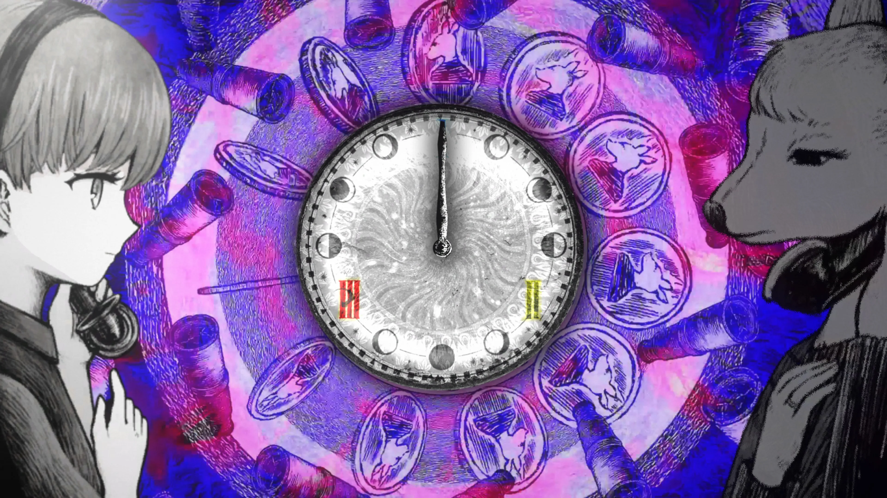
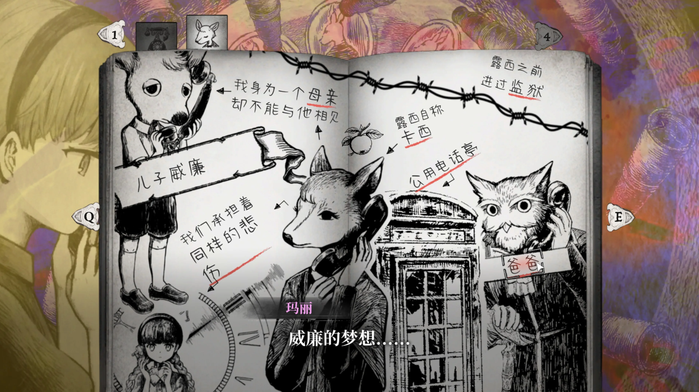

---
# 文章标题（展示在卡片与文章页）
title: 薛定谔的电话
# 标签：用于标签页与卡片信息
# Demo 标签建议：期待:8.5（或 期待值:8.5 / expect:8.5）
tags:
  - 游戏
  - Demo体验
  - 期待:8
# 短链接 ID（用于历史风格 permalink）
abbrlink: d3675eab
# 创建时间（格式：YYYY/MM/DD HH:mm:ss）
createTime: 2026/06/28 16:29:04
# 永久链接（默认：/YYYY/MM/abbrlink/，末尾保留 /）
permalink: /2026/06/d3675eab/
# 封面图
cover: cover.webp
# 摘要（可选，不填可使用 <!-- more --> 自动截断）
excerpt: 在此一瞬，月亮坠入世界
# 草稿（可选，true 时不会出现在列表中）
# draft: true
---

::: warning
下方含有对第一章情节、演出的剧透，考虑到这是该游戏很重要的一部分，请自行决定是否观看，已将严重剧透的文本隐去
:::

这个游戏在 bilibili 上看到过视频，放在待看里面了好久没看，夏促了发现有 demo 就打算直接玩玩看了，一看封面就感觉会是我喜欢的风格！

## 氛围

这个游戏的第一章总体来说笼罩着一种神秘的氛围：黑暗的房间、失忆的少女、神秘的黑猫和一台电话，黑猫不断怂恿女孩作为「!!最后的倾听者!!」接下电话，当我们第一次握住听筒打招呼时，无数的声音从四面八方涌来，难道我们是在和很多人同时交谈？

随后，我们需要回答声音出现的几项问题，屏幕中不断变化的粒子会在回答后模糊形成某人的模样，但当我进一步与其交谈，会得到我并不能与它共鸣的结论，然而马上就会有新的身影出现，直到我们寻找到「承担着同样的悲伤」的人。

到此埋下了不少谜团，已经把我兴趣吊起来了：

- 主角的过去是什么样的？为什么她被选中？
- 其他人真的「!!尽数化为粒子!!」了吗？我们与电话对方的人交流是为了做什么？
- 黑猫和神秘的声音目的是什么？
- 游戏画面和声音好酷！这个配乐水平感觉非常不错呀

别急，下面就开始游戏了

## 玩法

基本上来说，我感觉故事的主要玩法就是通过「电话」来解决别人的心结，随着一通电话的推进，我们可以在笔记本上记下需要的内容!!言弹？证物？！!!，其他人要么只能与主角进行通话，要么就完全无法说话，因此主角需要在通话对象及其「关联因素」之间反复通话，或是记录线索或是当一下传话筒。

而故事推进到一定程度后，似乎就进入了类似于弹丸论破的「学级裁判」或逆转裁判的「法庭」阶段，我们需要从过去笔记本中收集的线索或我们自己的感受中选出合适的选项，从而推进剧情继续。

值得一提的是，主角似乎也能「观测」以前的某些通话，在这期间无法「干涉」，但或许在某种程度上她能够「续写」这段通话。

## 期待

睡了一觉起来又感觉第一章的故事比较普通了，确实还是音乐、演出做的很吸引人，让我有了那么好的感觉，这既是好事也是警钟：第一次看的演出和音乐比较惊艳，但是经历过后，后面的章节能否再现这样的惊喜感呢？即使是几个小时优秀的演出，也会让人逐渐适应，这时候就要考验你的故事了！
