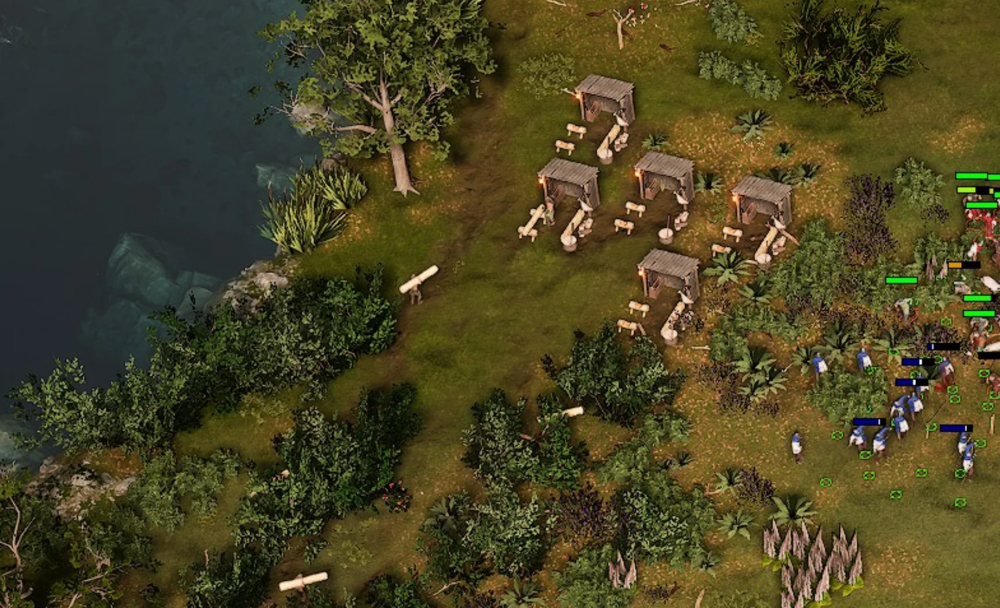
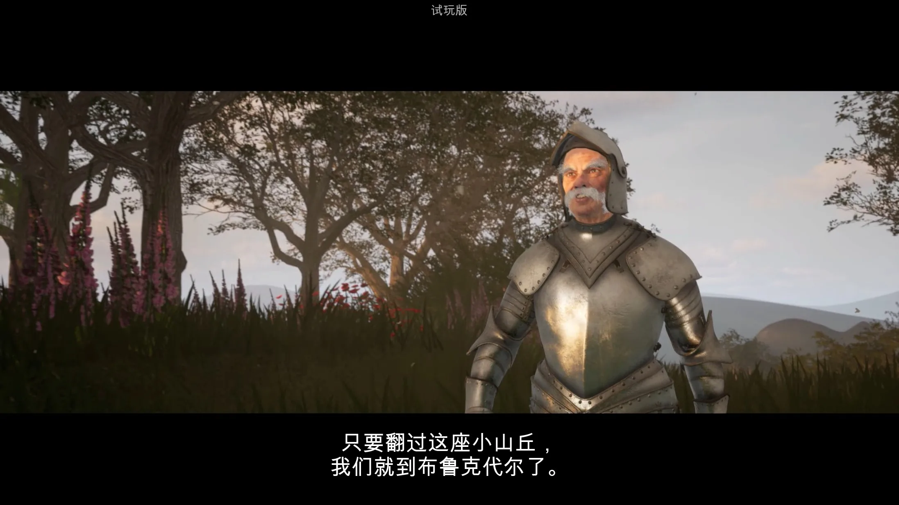
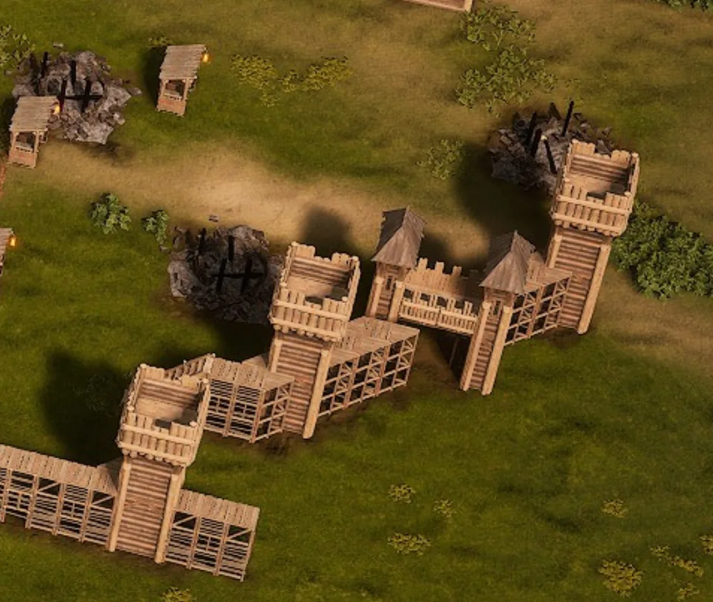
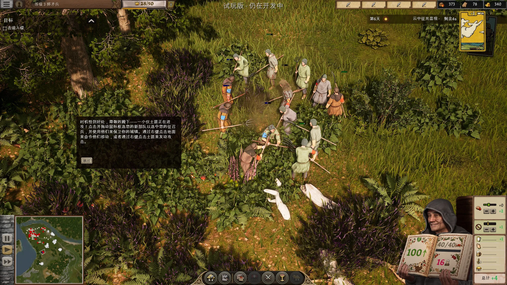
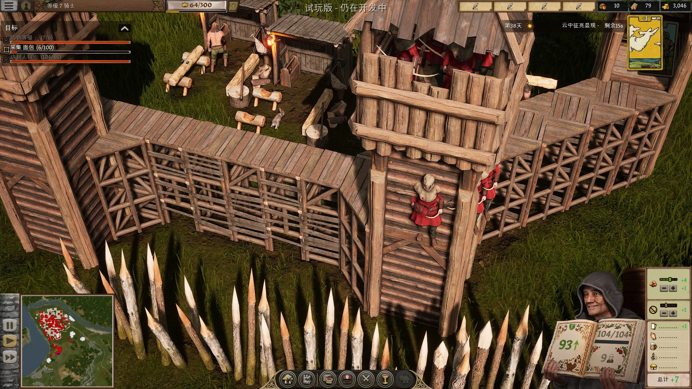
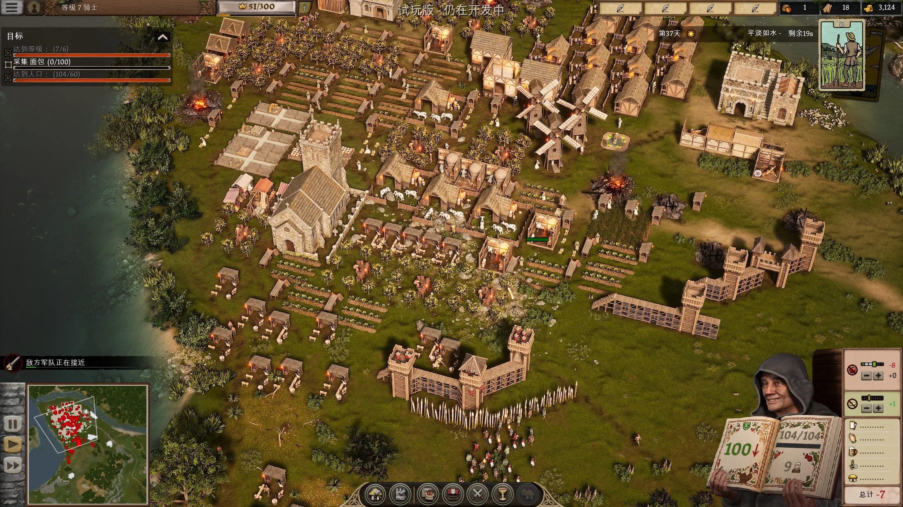

---
# 文章标题（展示在卡片与文章页）
title: 要塞4
# 标签：用于标签页与卡片信息
# Demo 标签建议：期待:8.5（或 期待值:8.5 / expect:8.5）
tags:
  - 游戏
  - Demo体验
  - 期待:4
# 短链接 ID（用于历史风格 permalink）
abbrlink: e137b183
# 创建时间（格式：YYYY/MM/DD HH:mm:ss）
createTime: 2026/06/28 22:11:34
# 永久链接（默认：/YYYY/MM/abbrlink/，末尾保留 /）
permalink: /2026/06/e137b183/
# 封面图（可选）
cover: 202606~4.webp
# 摘要（可选，不填可使用 <!-- more --> 自动截断）
excerpt: 尊敬的陛下！您的城堡正在等着您来建造
# 草稿（可选，true 时不会出现在列表中）
# draft: true
---

我从小其实就稍微接触过「要塞 / Stronghold」系列，不知道当初玩的是几，我记得那时候我很喜欢「帝国时代」系列，因此看到可能类似的游戏非常兴奋，但是上手玩了一下感觉难度颇高，当时一直没玩明白，今天看到了决定上去玩了下，可惜让我大为失望，这里向喜欢要塞系列的读者致歉，我在下文会对本游戏做出很多批评，其中很可能包含我对系列不熟悉而产生的偏见。

## 画面

我一向认为游戏的画面是加分项而不是核心因素，但是至少不能做的太差，一些合理的常识必须要有，但是本游戏的画面让我非常想吐槽的一点是低精度贴图+过度锐化，导致画面既模糊又充斥着高频噪音，观看起来对眼睛简直是折磨，这一问题尤其体现在地面上的植被和小物件上：

说实话，我宁愿看帝国时代2那样清晰锐利的像素画面，也不想看这样的3D画面，我也很想体量小厂的成本问题，但是我觉得完全有更好的办法，至少其他近年玩过的RTS游戏，我没见到画面这样的。但要说这作没用心也不太可能，像是工坊里村民工作的各项动作流程都还是比较好的，感觉对此很难评价。

游戏的UI、字体在高分辨率屏幕上表现的也较为糟糕，在熟悉了「天国：拯救2」或「帝国时代」的UI后，我觉得本作的UI真的是有些简陋了……

## 神秘开场

我不明白为什么要给我看这个领主发现自己领地被毁，然后有莫名奇妙的人出来协助他治理的动画……咱们没东西能别硬搞吗

## 玩法

我前面经常提到「帝国时代」主要还是因为我熟悉它，但是本作实际上体验和帝国时代差距是很大的，在我看来这个游戏具备更多经营、领地治理要素，而「帝国」更多是战斗，例如「要塞」中我们要合理规划食物种类、武器制造、赋税、宴会等事务，一方面要尽力提高自己的声望，一方面要制造足够的防御力量抵御入侵，体验倒是还算有趣，但是让我很不舒服的一点是士兵操作没有帝国时代那么清晰明了，城墙建造也有点莫名其妙，我本以为可以斜着建造城墙，然后在中间放门，结果变成了这样：

好吧，如果它能更加现代一点，完成度高一些，或许会是一个令我喜欢的游戏，但是它当下的情况，让我评估的话，我更可能去玩该系列评价好的老作品

