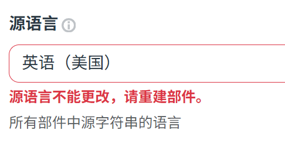
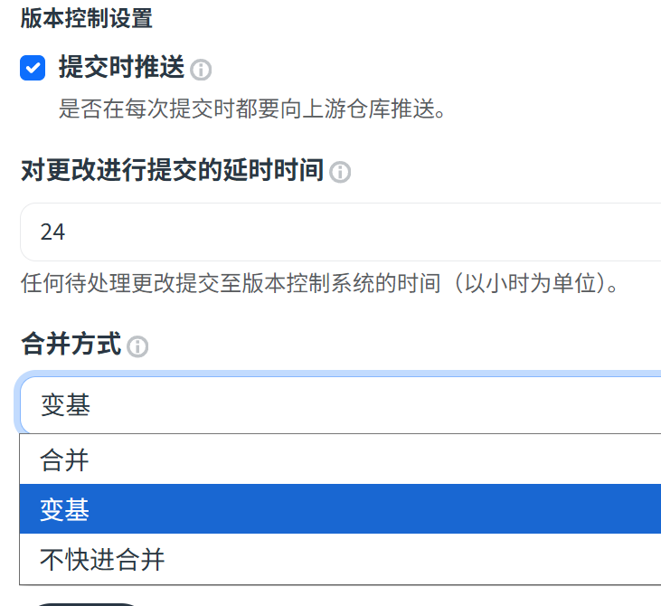
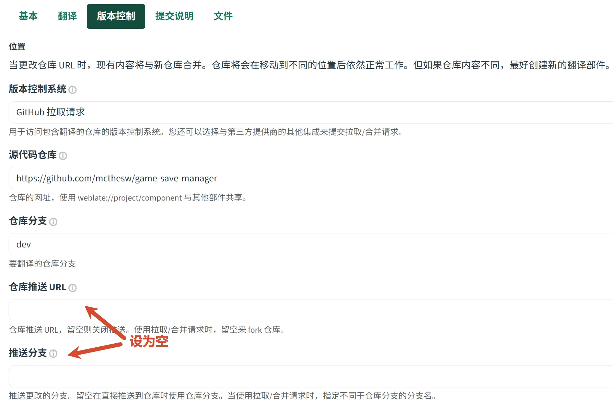
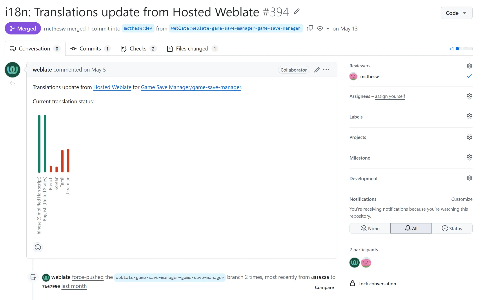
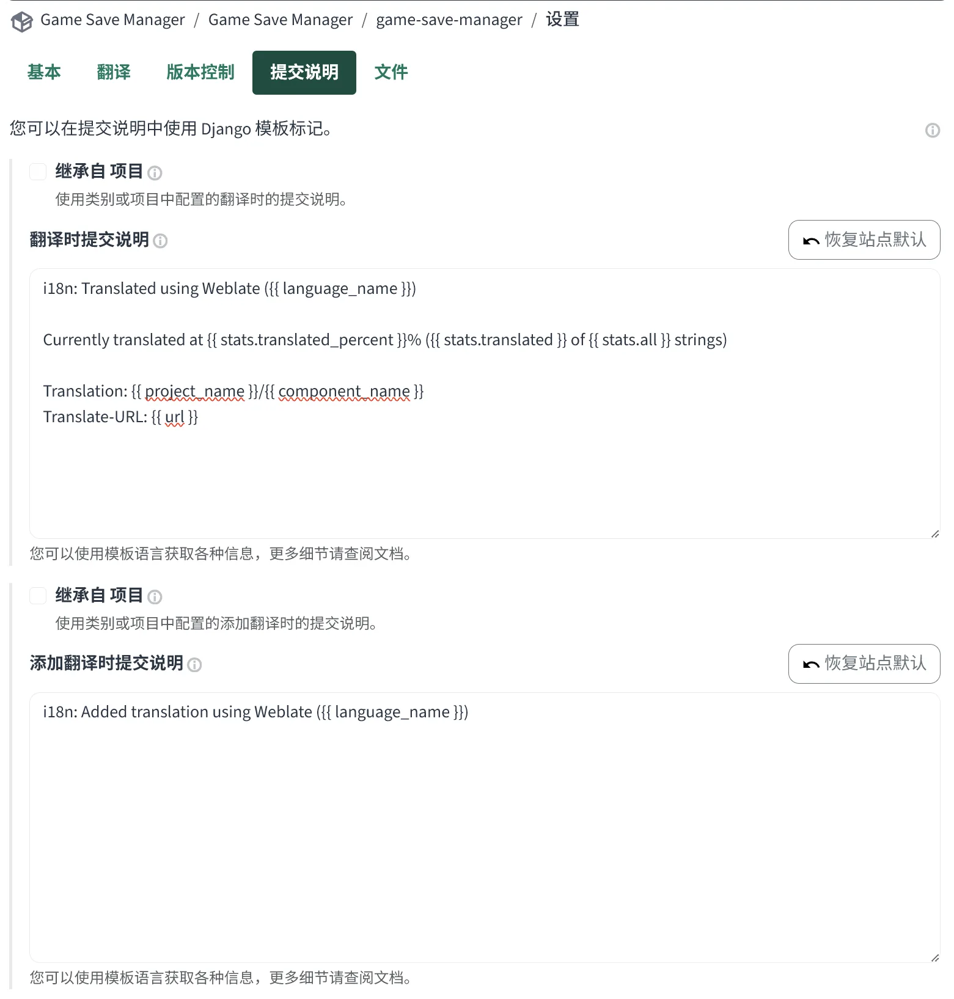

---
# 文章标题（展示在列表与文章页）
title: 开源项目国际化：翻译服务篇
# 标签（用于标签页与检索）
# 按内容自定义标签即可
tags:
  - 开源项目
  - Weblate
# 短链接 ID（用于历史风格 permalink）
abbrlink: f4b3b128
# 创建时间（格式：YYYY/MM/DD HH:mm:ss）
createTime: 2026/06/14 00:24:54
# 永久链接（默认：/YYYY/MM/abbrlink/，末尾保留 /）
permalink: /2026/06/f4b3b128/
# 封面图（可选）
# cover: /2026/06/f4b3b128/cover.webp
# 摘要（可选，不填可用 <!-- more --> 截断正文）
excerpt: 给开源项目维护者看的翻译服务接入 Weblate 的最佳实践
# 草稿（可选，true 时不会出现在列表中）
# draft: true
---

在维护 [游戏存档管理器](https://github.com/mcthesw/game-save-manager) 的时候，我希望能够让更多国家的玩家也能用上这个工具，因此针对 i18n 进行了一些调研，基本上主流 UI 框架都有提供或多或少的 i18n 功能，更重要的是如何让社区参与翻译协作。

我发现我常用的工具 [magpie](https://github.com/Blinue/Magpie) 使用的是 [Weblate](https://hosted.weblate.org/) 这个网站提供的服务，它为开源项目维护者提供了免费的、专业的翻译托管服务，因此我也用上它了！

本文将基于游戏存档管理器与 Weblate 的实践经历，分享为你的开源项目接入翻译服务的最佳实践。

## TL;DR

- 语言分等级支持，Tier1 应当在编辑代码时同时写入
- 翻译源语言推荐使用英语；Tier1 我推荐选择 Maintainer 母语和英语
- 翻译平台不写主仓库，而是通过 fork PR 将变更提入仓库
- 主仓库使用线性历史的提交风格，翻译平台通过 Rebase 获取主分支变更
- 不推荐使用自动机翻，尤其是 Tier1 语言

## 需要支持的语言

对于国内的开发者来说，优先支持中文和英文是很合适的选择。我个人将语言支持简单划分为了两个等级，T1代表我本人会进行维护，并且要求贡献者在变更文本时必须支持这两种语言，中文的缘由不用我多说，而英文是 GitHub 社区中协作使用最多的语言，不得不纳入T1。

考虑到中文已经由我直接维护，而开源社区贡献者们往往接触的是英文协作环境，因此我推荐将英文设为翻译的源语言，源语言需要谨慎挑选，因为 Weblate 的源语言不能更改……



而其它语言（Tier2 及以下）的支持，我感觉就完全看你的兴趣了，如果并没有什么特别想要支持的语言，就在保持 Tier1 质量的情况下让社区发挥吧！

## 分支管理策略

先说拉取，我的绝大多数仓库均使用线性历史的提交风格，也就是说我不希望历史里面出现 Merge commit，合并操作基本上通过 rebase 实现，自然 Weblate 也能够这样实现，在配置项中可以自行调整，在「组织名 - 项目名 - 组件名 - 设置 - 版本控制」中这样配置即可让它以变基的形式获取主分支最新的变更



现在解决了拉取的问题，我们需要解决推送的问题了，虽然 Weblate 支持直接推送到你的主仓库，但是我不推荐这样，因为这要求它长期维护一个分支，一方面我不喜欢仓库中出现一个专门的 translate 分支，另一方面我希望能够自动生成 PR，以便于审阅，于是可以这样配置以禁用推送到分支



此后将会有 Weblate 机器人向你的仓库提 PR 了！



合并后 Weblate 会通过 webhook 自动感知仓库变更并 rebase 到最新主分支。


## 文件格式的区分

在选择翻译文件的布局、格式时你常会看到下面的两种模式：

```yaml
# locales/setting.yaml
- confirm-button
  - zh_CN: "确认"
  - en_US: "Confirm"
```

```jsonc
// locales/zh_CN.json
{
  "setting": {
    "confirm-button": "确认"
  }
}

// locales/en_US.json
{
  "setting": {
    "confirm-button": "Confirm"
  }
}
```

对我来说，这两种方式没啥区别，我认为前者的主要优势在于如果你使用 Cursor 那种 Tab 补全功能时能顺手把所有语言的文本都一起补上（请一定要小心AI翻译的质量问题），而后者会让同一个语言的译者能轻松地参考上下文，毕竟附近其他东西很可能是在同一页面上的。

Weblate 支持的格式很多，我认为任意选择你喜欢的（或者框架默认支持的）就好了，不必太纠结。

我自己的文件侧配置比较普通：`locales/*.json`、JSON nested structure、4 空格缩进。第一次接入时 Weblate 会按自己的 JSON 格式重写文件，所以第一个 PR 会大一点。

## Commit 配置细项

在「提交说明」板块可以自行修改 commit 信息，默认是 `chore(i18n): xxx`，不过我仓库用 release-please 自动生成更新日志，而它会过滤掉 `chore()` 类型的 commit，所以我改成了 `i18n: xxx`，仅此而已



## 参考资料

- [Weblate: Continuous localization](https://docs.weblate.org/en/latest/admin/continuous.html)：Weblate 与上游仓库同步、push/PR、Repository maintenance、避免合并冲突等
- [Weblate: Component configuration](https://docs.weblate.org/en/latest/admin/projects.html)：版本控制系统配置项说明
- [Weblate: Automatic suggestions](https://docs.weblate.org/en/latest/admin/machine.html)
- [Weblate: Add-ons](https://docs.weblate.org/en/latest/admin/addons.html)
- [GitHub Docs: About pull request merges](https://docs.github.com/en/pull-requests/collaborating-with-pull-requests/incorporating-changes-from-a-pull-request/about-pull-request-merges)：GitHub 中 merge commit、squash merge、rebase and merge 的区别